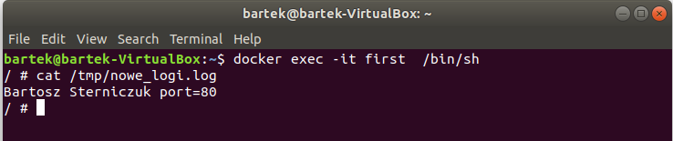

# Sprawozdanie z przedmiotu "Programowanie w chmurze obliczeniowej" - Projekt 1 
W sprawozdaniu zostały wykonane wszystkie ćwiczenia obwiązkowe. 

>link Github: https://github.com/Bartistero/projekt1  
link DockerHub: https://hub.docker.com/r/bartister99/projekt
## Tabela zawartości
* [Zadanie 1 ](#Zadanie-1)
* [Zadanie 2](#Zadanie-2)
    * [Zbudowanie obrazu](#zbudowanie-opracowanego-obrazu-kontenera)
    * [Uruchomienie kontenera](#uruchomienie-kontenera ) 
    * [Uzyskanie logów](#uzysaknie-dostępu-do-logów)
    * [Sprawdzenie warstw](#sprawdzenie-warstw)
* [Zadanie 4.1](#zadanie-4.1)
* [Zadanie 4.2](#zadanie-4.2)
* [Status](#status)
* [Kontakt](#contact)

## Zadanie 1
W zadaniu pierwszym, kod progamu został npisany przy użyciu języka PHP. Opisanie logi są zapisywane do pliku `/tmp/nowe_logi.log`

## Zadanie 2

### Zbudowanie opracowanego obrazu kontenera

W celu zbudowania obrazu należy wykonać polecenie: 
>`docker build --tag bartister99/projekt:1 .`
Polecenie tag służy do nadawania obrazowi nazwy.
* bartister99 -> nazwa repozytorium dockerHub,
* projekt1 -> nazwa projektu, 
* :1 ->  wersja.

Końcowa kropka oznacza konatekst, tzn. iż plik dockerfile znajduję się w katalogu, w którym obecnie jest otwarty terminal 

### Uruchomienie kontenera 

W celu uruchomienia należy wydać następującą komendę: 
>`docker run --name first  -p 80:80 bartister99/projekt1:1`
Wyjaśnienie powyższego polecenia: 
* wartość name oznacza nadanie nazwy utworzonemu konternerowi 
* -p przekierowywuje porty pomiędzy kontenerem a SO, w moim wypadku jest to port 80 
* pozostała cześć to nazwa obrazu

### Uzysaknie dostępu do logów

W celu uzyskania informacji (logów) zapisanych przez serwer należy przejśc do [katalogu](#general-info).  W tym celu należy otworzyć kolejne okno terminala i wykonać następującą intrukcję
> `docker exec -it first  /bin/sh`
Jest to polecenie służące do podłączania się do działającego kontenera, opcja -it podłącza klawiaturę komputera do termianala konternera. Po wejściu do kontenera należy wykonać następujące polecenie: 
>`cat /tmp/nowe_logi.log`
Jest to standardowe polecenie systemu linux, powoduje ono wyświetlenie pliku tekstowego na konsoli 

#### Sprawdzenie warstw

W celu sprawdzenia ile warstw zawiera obraz należy wydać następujące polcenie:
>`docker history bartister99/projekt1:1` 
Powyższe polecnie ukazuję historię budowania obrazu od obrazu bazowego, aż do powstania warty Read/Write. 

W celu uzyskania automatycznej budowy obrazu na dokcerhub należy połączyć konta github z kontem dockerhub, co niestety w ostanim czasie wymaga wersji pro w serwisie docker'a. Należy podkreślić, iż jest to ciekawe rozwiązanie i napewno przydatne w projektach komercyjnych. Wypchnięcie commita/mergowanie gałęzi przypisanej do dockera powoduje automatyczne załączenie testów CI a także automatyczne budowanie obrazu. Opisany powyżej przebieg dzeieje się w sposób automatyczny, a dodatkowo pozwala na wkyrwanie błędów oprogramowania jeszcze we wczesnym etapie.
## Zadanie 4.1
W celu uzyskania dostępu do `registry` należy na początku je pobrać ze zdalnego repozytorium dockerhub. 
>`docker pull registry `
Nie została podana wersja, w związku z tym zostanie użyta najnowsza wersja.

W celu uruchomienia kontenera należy wykonać następujące polecenie: 

>`docker run -d -p 6677:5000 --name registry registry`

Pobranie najnowszego obrazu Ubuntu następuje przy pomocy polecenia: 
>`docker pull ubuntu`

Następnie należy utworzyć tag do obrazu ubuntu:

>`docker image tag ubuntu localhost:6677/myfirstimageubuntu`

a następnie wypchać obraz do repozytorium 
>`docker push localhost:6677/myfirstimageubuntu`

## Zadanie 4.2
W celu wykonanian zadania, zgodnie z dokumentacji należy utworzyć nowy folder do przechowywania hasła 
>`mkdir auth   mkdir auth
 docker run \
  --entrypoint htpasswd \
  httpd:2 -Bbn testuser testpassword > auth/htpasswd`
  
Następnie uruchomić kontener zgodnie z instrukcją: 

>`docker run -d \
  -p 5000:5000 \
  --restart=always \
  --name registry \
  -v "$(pwd)"/auth:/auth \
  -e "REGISTRY_AUTH=htpasswd" \
  -e "REGISTRY_AUTH_HTPASSWD_REALM=Registry Realm" \
  -e REGISTRY_AUTH_HTPASSWD_PATH=/auth/htpasswd \
  -v "$(pwd)"/certs:/certs \
  -e REGISTRY_HTTP_TLS_CERTIFICATE=/certs/domain.crt \
  -e REGISTRY_HTTP_TLS_KEY=/certs/domain.key \
  registry:2`
 

## Status
Project is: finished

## Kontakt
Created by [@Bartistero](https://github.com/Bartistero/) - feel free to contact me!